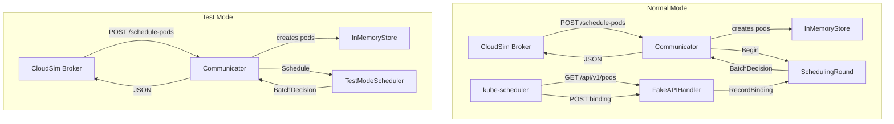

# Design Document: coubes-next-phase

## Overview

This document covers the design for two additions to the COUBES infrastructure:

1. **Adapter Test Mode** — a `--test-mode` CLI flag for `k8s-cloudsim-adapter/` that enables standalone round-robin scheduling without KWOK or a real kube-scheduler. All five simulation-facing HTTP endpoints remain fully functional; the fake Kubernetes API server routes are suppressed.

2. **Scheduler Dockerfile** — an improved Dockerfile and supporting configuration in `second-scheduler/` (updated in-place) that packages a named `kube-scheduler` with a multi-profile `KubeSchedulerConfiguration` (LeastAllocated + MostAllocated), a `docker-compose.yml` with `network_mode: host`, and a README.

The `cloudsim-7.0/` and `k8s-in-the-loop/` directories are read-only and are not touched.

---

## Architecture

### Feature 1: Adapter Test Mode

The adapter currently has two layers of routing:

- **Simulation-facing routes** (`/nodes`, `/schedule-pods`, `/pods/update-state`, `/reset`, `/pods/{id}/status`) — handled by `Communicator`.
- **Fake Kubernetes API routes** (`/api/v1/nodes`, `/api/v1/pods`, binding endpoints, etc.) — handled by `FakeAPIHandler`, intended for the kube-scheduler process.

In test mode the second layer is omitted entirely. The `Communicator` is wired to a `TestModeScheduler` instead of a `SchedulingRound`, so scheduling decisions are produced synchronously in-process.



The `Communicator` struct gains a `testMode bool` field and an optional `*TestModeScheduler`. When `testMode` is true, `HandleSchedulePods` and `HandleUpdateState` call the `TestModeScheduler` directly instead of going through `SchedulingRound`. The `main.go` conditionally registers the fake API routes only when `testMode` is false.

### Feature 2: Scheduler Dockerfile

The existing `second-scheduler/` folder is updated in-place:

- `my-scheduler.yaml` → replaced with a two-profile `KubeSchedulerConfiguration` (keeps the same filename for backward compatibility with the existing Dockerfile CMD).
- `Dockerfile` → updated with inline comments; the CMD and COPY instructions remain structurally identical.
- `docker-compose.yml` → updated with comments, `--v=2` flag, and a commented-out volumes override section.
- `README.md` → rewritten to cover prerequisites, build/run commands, profile selection, and troubleshooting.

No new folder is created; the existing `second-scheduler/` is the canonical location.

---

## Components and Interfaces

### New: `TestModeScheduler` (`scheduler/test_mode_scheduler.go`)

```go
// TestModeScheduler performs deterministic round-robin pod-to-node assignment
// without contacting any external process.
type TestModeScheduler struct{}

// Schedule assigns each pod in `pods` (zero-indexed in order received) to
// sortedNodes[i mod M], where sortedNodes is sorted lexicographically by node name.
// Returns a BatchDecision with BindingTimestamp set to time.Now() for each assignment.
// If len(nodes) == 0, all pods are returned as Unschedulable with reason "no nodes available".
func (s *TestModeScheduler) Schedule(pods []communicator.CsPod, nodes []communicator.CsNode) scheduler.BatchDecision
```

The function is pure (no side effects beyond reading the clock) and lives in the `scheduler` package alongside `SchedulingRound`. It reuses the existing `PodAssignment`, `PodFailure`, and `BatchDecision` types — no new types are introduced.

### Modified: `Communicator` (`communicator/communicator.go`)

Two new fields:

```go
type Communicator struct {
    // ... existing fields ...
    testMode  bool
    testSched *scheduler.TestModeScheduler // nil in normal mode
}
```

`NewCommunicator` gains a `testMode bool` parameter. When `testMode` is true, it initialises `testSched` and the `round` parameter is ignored (can be `nil`).

`HandleSchedulePods` branches on `c.testMode`:
- Normal: existing `round.Begin` / `round.Wait` path.
- Test: calls `c.testSched.Schedule(pods, c.store.GetNodes())` synchronously and returns the result.

`HandleUpdateState` (new handler, see below) similarly branches.

### New: `HandleUpdateState` (`communicator/communicator.go`)

The existing `POST /pods/update-state` handler is currently named `HandleSchedule` and handles a `SimulationSnapshot`. The requirements call for a dedicated `POST /pods/update-state` endpoint that:

1. Deletes the specified pod from the store.
2. In test mode: if there are pending pods (pods with no `nodeName`), runs `TestModeScheduler.Schedule` on them and returns the `BatchDecision`.
3. In normal mode: existing behaviour (delegates to `SchedulingRound`).

The handler is registered at `/pods/update-state` in `main.go`.

### Modified: `main.go`

```go
var testMode = flag.Bool("test-mode", false, "Run in standalone test mode (no kube-scheduler required)")
```

Conditional route registration:

```go
if !*testMode {
    // register /api/v1/nodes, /api/v1/pods, binding endpoints, etc.
}
```

Log message when test mode is active:

```
[TEST MODE] Adapter running in standalone test mode. No kube-scheduler connection will be made.
```

---

## Data Models

No new persistent data models are introduced. The `TestModeScheduler` reuses all existing types:

| Type | Package | Role |
|---|---|---|
| `CsNode` | `communicator` | Input to scheduler; `Name` field used for lexicographic sort |
| `CsPod` | `communicator` | Input to scheduler; `ID` field used to compute `PodAssignment.PodID` |
| `PodAssignment` | `scheduler` | Output: `{PodID, NodeID, BindingTimestamp}` |
| `PodFailure` | `scheduler` | Output when M=0: `{PodID, Reason: "no nodes available"}` |
| `BatchDecision` | `scheduler` | Wrapper: `{Scheduled []PodAssignment, Unschedulable []PodFailure}` |

The round-robin formula:

```
sortedNodes = sort(nodes, by: name, order: lexicographic ascending)
for i, pod := range pods:
    assignment[i].NodeID = extractID(sortedNodes[i % M].Name, "csnode-")
    assignment[i].PodID  = pod.ID
    assignment[i].BindingTimestamp = time.Now()
```

`extractID` is the existing helper in `scheduler/scheduler.go`.

### Scheduler Configuration Data Model

The updated `my-scheduler.yaml` defines two profiles under a single `KubeSchedulerConfiguration`:

```yaml
profiles:
  - schedulerName: default-scheduler   # LeastAllocated (spreading)
    ...
  - schedulerName: my-scheduler        # MostAllocated (bin-packing)
    ...
```

Both profiles disable all score plugins except `NodeResourcesFit` and configure it with equal `cpu`/`memory` weights. `leaderElection.leaderElect: false` applies globally.

---

## Correctness Properties

*A property is a characteristic or behavior that should hold true across all valid executions of a system — essentially, a formal statement about what the system should do. Properties serve as the bridge between human-readable specifications and machine-verifiable correctness guarantees.*

### Property 1: Assignment completeness and uniqueness

*For any* list of N pods (N ≥ 0) and M nodes (M ≥ 1), the `TestModeScheduler` SHALL produce a `BatchDecision` where `len(Scheduled) + len(Unschedulable) == N` and no pod ID appears more than once across both lists.

**Validates: Requirements 4.1**

### Property 2: Round-robin formula correctness

*For any* list of N pods and M nodes (M ≥ 1), the `TestModeScheduler` SHALL assign pod at index `i` (zero-indexed in the order received) to the node at position `i mod M` in the lexicographically sorted node list. Running the scheduler twice on the same inputs (with no intervening state change) SHALL produce identical assignments.

**Validates: Requirements 2.2, 4.3**

### Property 3: Balance invariant

*For any* list of N pods and M nodes (M ≥ 1), the number of pods assigned to each node SHALL be either `floor(N/M)` or `ceil(N/M)`.

**Validates: Requirements 4.2**

### Property 4: BindingTimestamp presence

*For any* list of N pods and M nodes (M ≥ 1), every `PodAssignment` in the `BatchDecision.Scheduled` list SHALL have a non-zero `BindingTimestamp`.

**Validates: Requirements 2.4**

### Property 5: Update-state rescheduling in test mode

*For any* set of pending pods and available nodes, calling `POST /pods/update-state` in test mode SHALL return a `BatchDecision` for the pending pods produced by the `TestModeScheduler`, satisfying the same round-robin formula as Property 2.

**Validates: Requirements 3.3**

### Property 6: Reset empties store

*For any* adapter state (arbitrary nodes and pods registered), calling `DELETE /reset` SHALL result in an empty `InMemoryStore` (zero nodes, zero pods) regardless of prior state.

**Validates: Requirements 3.4**

---

## Error Handling

| Scenario | Behaviour |
|---|---|
| `POST /schedule-pods` in test mode, M=0 nodes | Return `BatchDecision` with all pods in `Unschedulable`, reason `"no nodes available"`, HTTP 200 |
| `POST /schedule-pods` in normal mode, round already active | HTTP 409 (existing behaviour, unchanged) |
| `POST /schedule-pods` in normal mode, timeout | HTTP 408 (existing behaviour, unchanged) |
| `POST /pods/update-state`, pod ID not found | HTTP 404 |
| `GET /pods/{id}/status`, pod not found | HTTP 404 (existing behaviour, unchanged) |
| `--test-mode` + `--kubeconfig` both set | Log a notice, ignore `--kubeconfig`, continue normally |
| Fake API routes called in test mode | HTTP 404 (routes not registered) |

---

## Testing Strategy

### Unit tests (example-based)

- `TestModeScheduler.Schedule` with N=0 pods: verify empty `BatchDecision`.
- `TestModeScheduler.Schedule` with M=0 nodes: verify all pods in `Unschedulable` with correct reason.
- `TestModeScheduler.Schedule` with N=1, M=1: verify single assignment to the only node.
- `TestModeScheduler.Schedule` with N=5, M=3: verify exact assignments `[0,1,2,0,1]` (mod 3).
- `main.go` flag parsing: verify `testMode=true` when `--test-mode` is passed.
- `main.go` flag parsing: verify `--kubeconfig` is silently ignored in test mode.

### Property-based tests

The project already uses [`pgregory.net/rapid`](https://github.com/pgregory/rapid) for property-based testing (evidenced by `testdata/rapid/` directories in `scheduler/` and `store/`). All property tests use `rapid` with a minimum of 100 iterations.

Each test is tagged with a comment in the format:
```
// Feature: coubes-next-phase, Property N: <property text>
```

**Property 1 test** (`scheduler/test_mode_scheduler_test.go`):
- Generators: `rapid.IntRange(0, 50)` for N, `rapid.IntRange(1, 20)` for M.
- Generate N pod names and M node names.
- Assert `len(Scheduled) + len(Unschedulable) == N`.
- Assert no duplicate pod IDs in either list.

**Property 2 test**:
- Same generators.
- For each `PodAssignment`, assert `NodeName == sortedNodes[podIndex % M]`.
- Run scheduler twice on same input, assert outputs are identical.

**Property 3 test**:
- Same generators.
- Count assignments per node, assert each count is `floor(N/M)` or `ceil(N/M)`.

**Property 4 test**:
- Same generators (M ≥ 1).
- Assert every `PodAssignment.BindingTimestamp.IsZero() == false`.

**Property 5 test** (`communicator/communicator_test.go` or integration test):
- Generate a set of pending pods and nodes.
- Call `HandleUpdateState` via `httptest`.
- Assert the returned `BatchDecision` satisfies the round-robin formula.

**Property 6 test** (`store/store_test.go` or integration test):
- Generate arbitrary nodes and pods, add them to the store.
- Call `HandleReset`.
- Assert `store.GetNodes()` and `store.GetPods()` both return empty slices.

### Integration / smoke tests

- Start adapter in test mode, POST /nodes, POST /schedule-pods, verify round-trip.
- Start adapter in test mode, verify `/api/v1/nodes` returns 404.
- Verify `my-scheduler.yaml` parses as valid `KubeSchedulerConfiguration` with two profiles.
- Verify `kubeconfig.yaml` server field is `http://localhost:8080`.
