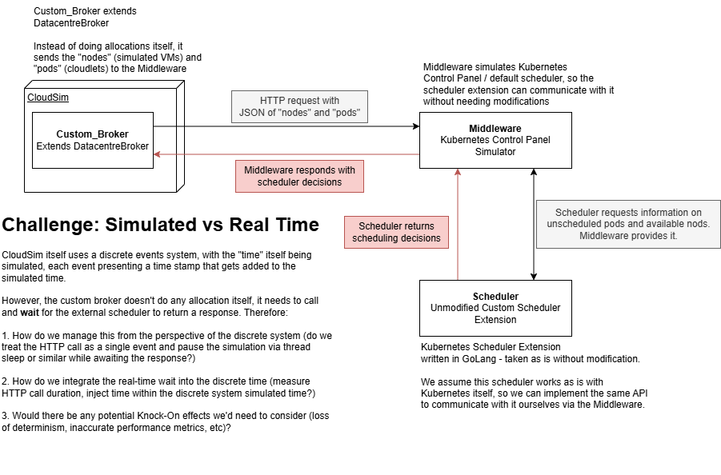

### CloudSim-Experimental

This is a **Proof of Concept Prototype** repository, currently in transition to a more mature and thought out implementation.

The goal is to create an extension to CloudSim that allows it to be used 
as a testing harness for Kubernetes Schedulers.

The way we aim to achieve this is by creating an extension to DatacentreBroker (named `Live_Kubernetes_Broker`)
that delegates scheduling/allocation tasks to the Kubernetes scheduler via
an adapter. The adapter converts the CloudSim resources (e.g. GuestEntities and Cloudlets) into
fake K8s equivalents (nodes and pods) using [KWOK](https://kwok.sigs.k8s.io/), then waits for the
cluster to perform scheduling. Following successful scheduling, the adapter returns the results back to CloudSim,
which interprets them as native CloudSim resources and resumes simulation.

##### Prototype Design
This design is outdated but roughly showcases the original thought process. Soon to be updated.

### Structure
- `src/main/java/org/example` - Main folder for CloudSim simulations and the
`Live_Kubernetes_Broker` custom class that implements communication to the middleware.
- `k8s-cloudsim-adapter` - the kubernetes control plane simulator, acting as the middleware/adaptor
between CloudSim and Kubernetes.

### How to run
You'll need `Go`, `KWOK` and `Java JDK21` installed.
1. Within the `k8s-cloudsim-adapter`, run `go run main.go` to start the middleware/adapter.
2. From the CLI, prepare the KWOK cluster using `kwokctl create cluster` then `kubectl cluster-info --context kwok-kwok`
4. Build and Run `src/main/java/org/example/Custom_Broker_Example.java`

The simulation should successfully run, with roughly ~240 cloudlets succeeding.
